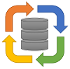

|logo| DBImport
===============

Ingestion of data into Hive in a Hadoop cluster is both easy and hard. The first initial load, usually with sqoop, is fairly easy. Connect to the source system and start to fetch. And with the right version of Hive, you can get the table auto created for you with the data. That’s great and simple. But once that first couple of tables are delivered to the users, the usually want more. And they want to load it every day or hour. 

Ok, so we put sqoop into a bash script and run it in cron. Problem solved! Well, after a while you will be drowning in those sqoop scripts. And then suddenly they stop to work. Some “dude” on the source system change their table definitions and renamed a couple of columns. But didn’t tell anyone as “it’s handled inside their application”. So that morning when the Hadoop team arrives at work, they got a bunch of upset users that don’t have fresh data. 

This is where DBImport comes to the rescue. With DBImport running those imports, the scenario above would only be an entry in a log file saying that the source table was changed and everything is still working. 

High Level Functionality
------------------------

So DBImport brings the following to the table

-   Full support for importing and exporting data to Oracle, MsSQL, MySQL, DB2-UDB, DB2-AS400, Progress and PostgreSQL databases
-   Auto discovery of tables and views from all supported source systems
-   Supports both Full and Incremental imports and exports
-   Supports Oracle Flashback Query for Incremental imports
-   Supports Microsoft Change Tracking for Incremental imports
-   Handle column definition changes in source systems
-   Handle column description changes in source systems
-   Handle Primary and Foreign Keys from source systems
-   Can use Merge for changed data ingestion from source systems
-   Ability to create Audit change tables from both Full and Incremental Imports
-   Tight integration with Apache Airflow for scheduling and parallel execution
-   Full logging and statistics of all imports and exports to Hive

Ease of use
-----------
Let’s say that you have a source system with 1000 tables and you need to import these into Hive. With DBImport, these are thee steps you would have to do

1.  Create a connection to the source system. (enter hostname, port, username, password, database name and such)
2.  Run one command that will connect to the source system and search for tables and views that you can import. You then get a list of the found items and a question if these are the tables you want to add to DBImport. Answer ‘Yes’ and the tables/views are now configured for import.
3.  Create an Airflow Import Dag configuration. With the filter you specify all tables you just identified
4.  Generate the Airflow DAG. 
5.  The DAG is now visible in Airflow and when started, all tables will be imported into Hive. 
6.  This DAG can be scheduled to run at an interval, lets say every day. If you do that, and there are changes in the tables you are importing, DBImport will detect this automatically and redo the same changes on the tables in Hive.

Links
-----

- `Documentation <https://dbimport.readthedocs.io/>`_
