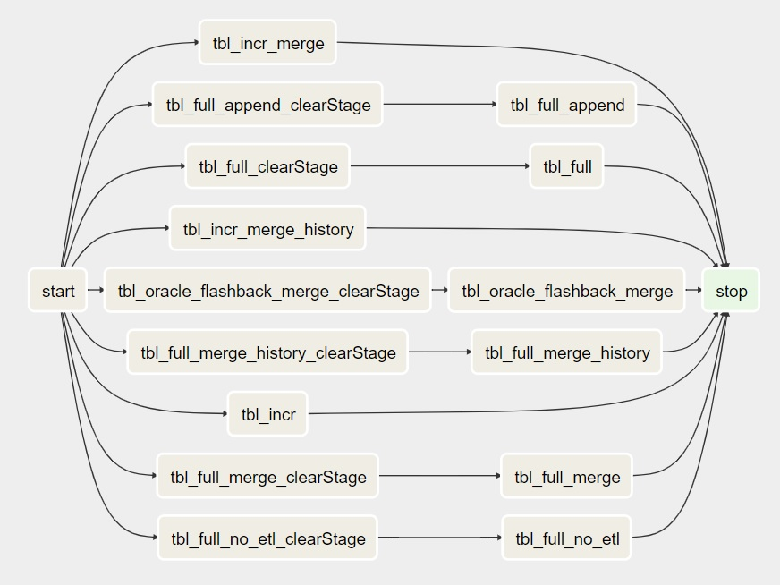
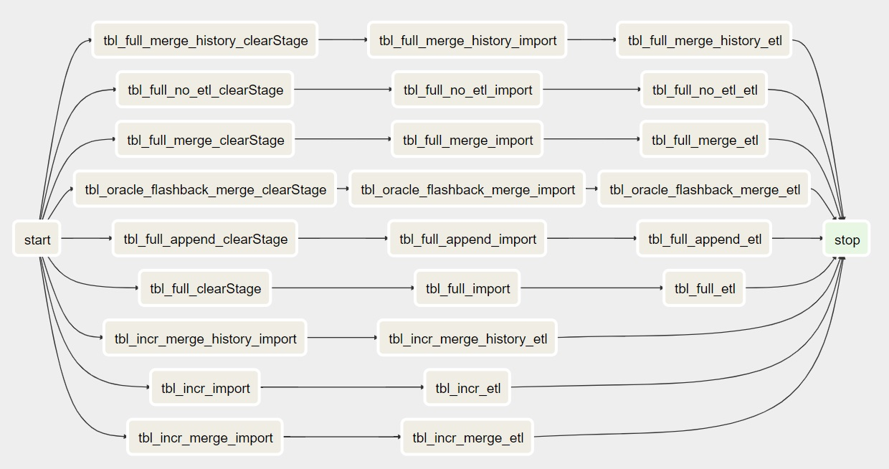

Airflow Integration
===================

As the number of databases and tables that DBImport is importing, the need to automate the scheduling of these imports grows aswell. This is where the integration with Airflow is so useful. The basic of it is that DBImport generate the DAG to Airflow including all the steps that is required to import the tables defined in DBImport. The result is that no large intevention is needed to schedule and operate an environment with with 10000's of tables running daily imports.

As described in the :doc:`quickstart` guide, the command to generate the Airflow DAG is the following::

./manage --airflowGenerate --airflowDAG=<DAG NAME>

**Example used on this page**

In order to show how a DAG is generated, a demo environment have been setup with one table imported for each *import_type* with the name having the prefix of *tbl_*. So a *full_append* import is called *tbl_full_append* and they are all in the Hive database *demo*. 

A DAG have also been created in the *airflow_import_dags* table with the following settings

=================== ============================================================
dag_name            DBImport_DEMO
schedule_interval   None
filter_hive         demo.*
=================== ============================================================

Generate a DAG
--------------

In order to generate the DAG as described under Examples above, run the following command::

./manage --airflowGenerate --airflowDAG=DBImport_DEMO

This will create a DAG file in a staging table as configued in *airflow_dag_staging_directory*. The staging directory is not used by Airflow and the file will never be activated from there. But it's a good place to check the file to verify that it looks correct. Only needed for very complex DAG's with many independent tasks and dependencies. But as this is a simple DAG, we add the -w  or the --airflowWriteDAG to the command and write the DAG directy to Airflow::

./manage --airflowGenerate --airflowDAG=DBImport_DEMO --airflowWriteDAG

The DAG is now available in Airflow and in paused mode. As soon as it's un-paused, it can be viewed and started from Airflow.

Default DAG layout
------------------

With the DAG just specified with default settings like what is described earlier on this page, a DAG will be created in Airflow and it will look something like this. 

clearStage Tasks
^^^^^^^^^^^^^^^^

As you can see in the picture above there are a couple of *clearStage* tasks before the actual import Task. They are created for full imports and will reset whatever stage the previous import was in. This will force the Task to start from the beginning. As it's a full import, there is no risk of losing data as we read everything anyway. And that's the reason why there are no *clearStage* task before the incremental imports. If the previous incremental import failed, we might be in a position where we read the data from the source but unable to insert it into Hive. Forcing a restart of the stage in that situation might result in loss of data.

start and stop Tasks
^^^^^^^^^^^^^^^^^^^^

The *start* and *stop* task is always there. Stop is just a dummy Task that is not doing anything. But it's very useful if another DAG wants a sensor so it continues after this DAG is completed. As stop is always at the end, it's safe (and usually default) to look at the status of the *stop* task.

The *start* task is not a dummy Task. It's actually running the following command at the start of the DAG::

./manage --checkAirflowExecution

This will check if the *airflow_disable* configuration is set to 1 or not. If it's set to 1, the *start* task will fail and the rest of the Tasks will not run. This is one of the options the operators have to temporary disable all DBImport executions. Useful during for example upgrade of DBImport or system components in order to make sure that no imports are starting.

Run Import and ETL separate
---------------------------

In the *airflow_import_dags* there is a column called *run_import_and_etl_separate*. If this is set to 1 and the DAG is regenerated, the result will look something like this.

As you can see, the DBImport task is now split into two. One for the actuall import where the communication with the source system is taking place and one for ETL work where the Hive operations are happening. As the Import and ETL Tasks are running as default in separate pools, this is useful in order to minimize the number of sessions against the source system but at the same time have a larger number of sessions in Hive.

Finish all Imports first
------------------------

In the *airflow_import_dags* there is a column called *finish_all_stage1_first*. If this is set to 1 and the DAG is regenerated, the result will look something like this.

.. note:: In the Legacy version of DBImport the *Import* and *ETL* phase was called *stage1* and *stage2*. That's why the column is called what it's called. This will most likely change name as soon as the Legacy version is decommissioned.

.. image:: img/airflow_finish_import_first.jpg

Now a new dummy task is added called *Import_Phase_Finished*. This Task will force all imports to be completed first before the ETl Tasks is started. This is useful to make sure that all tables is read successfully by sqoop before it's imported into Hive and made available to the users.

Customizing the DAG
-------------------

There are many ways to customize the DAG with additional Tasks. This can be SQL calls to execute after import is completed, sensors to run before the import to make sure that the data is loaded in the source system correctly before the import starts, trigger another DAG after a certain Task is completed or something else that solved each and every ones individual needs. 

As there are many options for a custom Task to integrate into the DBImport DAG, we will first describe the place ment of the Task in the DAG. The best way to describe this is to add a number of Tasks to the Demo DAG that we use as an example on this page. The following Tasks have been created in the *airflow_tasks* table. 

+---------------+-----------------+--------------+-------------+-------------------------+-------------------+
| dag_name      | task_name       | task_type    | placement   | task_dependency_in_main | task_config       |
+===============+=================+==============+=============+=========================+===================+
| DBImport_DEMO | before_main_01  | shell script | before main |                         | /usr/bin/sleep 1  |
+---------------+-----------------+--------------+-------------+-------------------------+-------------------+
| DBImport_DEMO | before_main_02  | shell script | before main |                         | /usr/bin/sleep 1  |
+---------------+-----------------+--------------+-------------+-------------------------+-------------------+
| DBImport_DEMO | in_main_01      | shell script | in main     |                         | /usr/bin/sleep 1  |
+---------------+-----------------+--------------+-------------+-------------------------+-------------------+
| DBImport_DEMO | in_main_02      | shell script | in main     | tbl_full,tbl_incr       | /usr/bin/sleep 1  |
+---------------+-----------------+--------------+-------------+-------------------------+-------------------+
| DBImport_DEMO | after_main_01   | shell script | after main  |                         | /usr/bin/sleep 1  |
+---------------+-----------------+--------------+-------------+-------------------------+-------------------+
| DBImport_DEMO | after_main_02   | shell script | after main  |                         | /usr/bin/sleep 1  |
+---------------+-----------------+--------------+-------------+-------------------------+-------------------+

With these custom Tasks the DAG will look something like this (custom Tasks marked in blue for better visualization)

.. image:: img/airflow_with_custom_tasks_blue.jpg

Regarding the placement, these are the options you have

============ ================================================================================================================================
before main  Tasks will be executed before the real DBImport starts. All these must be successfull in order for the normal imports to start
in main      Will be executed in parallel together with the import tasks
after main   Once all imports are completed, these tasks will run
============ ================================================================================================================================

**Task dependency in main**

For the custom Tasks running with placement *in main*, you have the option to specify dependencies. It means that you can run a task after one or more imports are completed. In the example above, the *in_main_02* task will only run after *tbl_full* and *tbl_incr* import tasks are completed successful.

Custom Task configuration
-------------------------

Common for all the custom tasks is the following configuration

=================== =============================================================== 
airflow_pool        Name of the Airflow pool to use. Will be created if not exists 
airflow_priority    The priority of the task
include_in_airflow  Enable or disable if this task should be in the configured DAG
=================== =============================================================== 

shell script
^^^^^^^^^^^^
This task will run a Unix command or a shell script. The script to run is configued in the *task_config* column

Hive SQL
^^^^^^^^
Executes a Hive query with the help of ``manage --runHiveQuery=<SQL QUERY>``. The <SQL QUERY> is a standard SQL command that is executable in Hive. The SQL Query is configured in the *task_config* column. 

Hive SQL Script
^^^^^^^^^^^^^^^
Executes all Hive queries in a file with the help of ``manage --runHiveScript=<FILE>``. The <FILE> is a text file containing one or many SQL Hive commands. The ``manage --runHiveScript`` is actually just a wrapper around *beeline* who will be the tool that executes the <FILE>. The file to use is configured in the *task_config* column.

JDBC SQL
^^^^^^^^
This will create a Task that executes a SQL Query against a JDBC source defined withing the *jdbc_connections* table. For that reason, you need to specify the JDBC connection in the *jdbc_dbalias* column together with the SQL Query in the *task_config* column

Trigger DAG
^^^^^^^^^^^
This will trigger an execution of another DAG. The name of the DAG to trigger is specified in the *task_config* column.

DAG Sensor
^^^^^^^^^^
A DAG Sensor task is the ability to wait for a task in another DAG to finish and continue once that task is successful. The configuration needed is the name of the DAG and Task. Here you have two options. Give the name of the DAG and the name of the Task or only the name of the DAG. If only the name of the DAG is given, it defaults to the *stop* task that is available in all DBImport DAGs and marks the end of all executed tasks. 

task_config column options

============= =================================================
<DAG>         Name of the DAG and will default to *stop* task
<DAG>.<TASK>  Wait for a specific task in a DAG
============= =================================================

There are two other parameters that controlls how ofter to poll for status and for how long the sensor should be doing that

======================= ======================================================================================================================
sensor_poke_interval    The time in seconds between pokes. Too low number will create stress on the Airflow Scheduler. Defaults to 5 minutes
sensor_timeout_minutes  The timeout time in minutes until the sensor gives up and are marked as failed. Defaults to 4 hours.
======================= ======================================================================================================================

SQL Sensor
^^^^^^^^^^
The SQL Sensor executes a SQL query against a Airflow connection. The sensor will keep trying as long as the SQL returns 0 rows or while the first column on the first row contains a 0. An example would be ``select count(*) from <A TABLE> where last_update > '<A TIMESTAMP>'``. If the count returns 0 rows, the sensor will keep on retrying. But when it returns rows, it will be marked as successful and the dependent tasks will start.

The following configurations is available for a SQL Sensor

======================= ======================================================================================================================
sensor_connection       The name of the Airflow connection that will be used to run the SQL. Configured under Admin / Connections in Airflow
task_config             The SQL query to execute
sensor_poke_interval    The time in seconds between pokes. Too low number will create stress on the Airflow Scheduler. Defaults to 5 minutes
sensor_timeout_minutes  The timeout time in minutes until the sensor gives up and are marked as failed. Defaults to 4 hours.
======================= ======================================================================================================================

*Multi cluster ingestion*

For multi cluster ingestions, this is the sensor that DBImport uses in the background to verify that data is loaded on the slave system beforestarting the import. The *sensor_connection* that is required is called **DBImport** and needs to be configured in Airflow connections with the same connection details as DBImport uses to connect to the configuration database. These are all available in the *dbimport.cfg* configuration file

The actual SQL Query that is executed is::

    select count(*) from import_tables where hive_db = '<HIVE DB>' and hive_table = '<HIVE TABLE>' and copy_finished >= '{{ next_execution_date.strftime('%Y-%m-%d %H:%M:%S.%f') }}'

