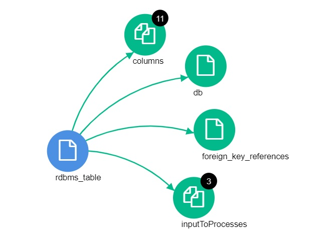
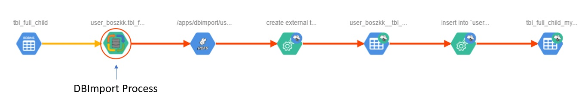

Atlas Integration
=================

Data Governance and metadata is one of the key resources in a data storage environment like Hadoop. The ability to get information like schema, lineage, owners, contact information and audit is extremely valuable for everybody that work with the data. The Atlas integration in DBimport will help with all of this information and make sure that it gets imported into Atlas correctly.

Import/Export and Discovery
---------------------------

There are two different ways to get the information into Atlas. 

**Import/Export**

When an import or export is running in DBImport, the process will connect to a remote SQL database and read the schema and data. The data will end up in Hive and the schema will be used in the DBImport configuration database. This schema will also be written to Atlas during import and export. That means that just that single table gets imported into Atlas. So if there are 100 tables in the remote database, and you are importing 5 of them to Hive. Atlas will only contain information about the 5 imported tables. The other 95 will be unavailable in Atlas.

**Discovery**

If the DBImport server is started, it will connect to the different remote SQL databases configured in the *jdbc_connections* table and read the entire schema and import all tables and views into Atlas. Include and exclude filters can be specified in the *jdbc_connections* table in order to limit the number of items that gets imported into Atlas. This is useful for maybe excluding a complete schema that is used only for testing.

What will be stored in Atlas?
-----------------------------

Regardless if the data comes from an Import or Export operation or is discovered by the DBImport server, the following information get stored in Atlas.

**rdbms_instance**

This object contains information about where the instance is running, what databases exists in it and how to connect to the instance.

=================== ============================================================================================
name                Name of the instance
databases           Links to the different databases available in the instance. This will be *rdbms_db* objects
hostname            Server that the instance is running at
port                Port to the instance
protocol            The protocol used to connect to. Hardcoded to JDBC as that's what DBImport is using
rdbms_type          What kind of instance it is. Example are Oracle, MSSQL, MySQL, Postgres and more
=================== ============================================================================================

**rdbms_db**

This object contains information about where the instance is running, what databases exists in it and how to connect to the instance.

=================== ============================================================================================
name                Name of the database
instance            Links to the *rdbms_instance* object that the database belongs to
tables              Links to the different tables available on the database. This will be *rdbms_table* objects
prodOrOther         Gets populated by the *environment* column in *jdbc_connections* table
owner               Gets populated by the *owner* column in *jdbc_connections* table
description         Gets populated by the *description* column in *jdbc_connections* table
contact_info        Gets populated by the *contact_info* column in *jdbc_connections* table
=================== ============================================================================================

**rdbms_table**

This object contains information about the SQL table.

=================== ============================================================================================
name                Name of the table
name_path           Schema of the table
db                  Links to the *rdbms_db* object that the table belongs to
columns             Links to the different columns available on the database. This will be *rdbms_column* objects
comment             Table comment from remote SQL database
type                Table or view. 
owner               Gets populated by the *owner* column in *jdbc_connections* table
contact_info        Gets populated by the *contact_info* column in *jdbc_connections* table
=================== ============================================================================================

**rdbms_column**

This object contains information about the different columns that exists in a table

=================== ============================================================================================
name                Name of the column
table               Links to the *rdbms_table* object that the column belongs to
comment             Column comment from the remote SQL database
data_type           Type of column
isNullable          True or False if the column is specified as allows null or not
isPrimaryKey        True or False if the column is part of the primary key
length              Length of the column. If the type is a varchar(45), the value 45 will be available here
owner               Gets populated by the *owner* column in *jdbc_connections* table
=================== ============================================================================================

**DBImport_Process**

This is the DBImport object that gets created in Atlas as part of the DBImport installation. The object contains information about the source and target, if it's an import or export and also serves as the object that will be part of the Lineage from the SQL table to the HDFS directory and further into Hive. 

=================== ============================================================================================
commandlineOpts     The entire command including the parameters that was used to run the DBImport tool
description         Description of what have been done in the process
startTime           Timestamp of when the DBImport process started
endTimepe           Timestamp of when the DBImport process stopped
importTool          Sqoop or Spark
input               Link to the input object. Usually *rdbms_table* for imports and *hive_table* for exports
output              Link to the output object. Usually *hdfs_path* for imports and *rdbms_table* for exports
operation           Import or Export
username            Name of user executing the DBimport process
=================== ============================================================================================

Relationships between objects
-----------------------------

There are different relationships created for the rdbms objects. In order for example a *rdbms_table* to exist in a *rdbms_db*, there is a relationship between them both. Those kind of relationships are documented in the tables above on each and every object where they exists. In addition to that, there is also relationships that gets created depending on the remote SQL configuration. This is a list of those relationships that gets created

**Foreign Keys**

There can be Foreign Keys on *rdbms_tables* that links two tables together in the same database. The information about the relationships comes from the remote SQL tables and is a reflection on how the remote tables are linked together. 

.. note:: Index will also be a kind of relationship that gets created. Support for Index on rdbms object in Atlas will come in a future version of DBImport

Graphical representation of what the relationships can look like in Atlas

Lineage
-------

One of the important functions of Atlas is to show the Lineage, the graphical representation of how data is flowing through your system. DBImport creates Lineage for all Imports and Exports. This will connect the rdbms_table objects in the remote SQL databases with the Hadoop environment. Nothing is needed to configure in order to use this functionality. All you need to do is to make sure Atlas integration is enabled and a Lineage as in the example below will be created in Atlas. 

