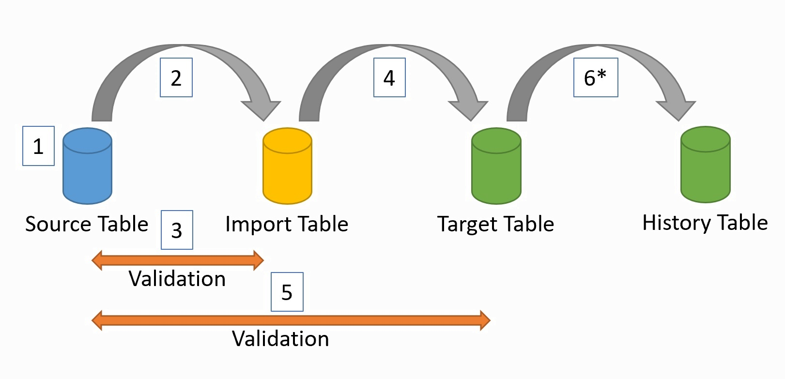
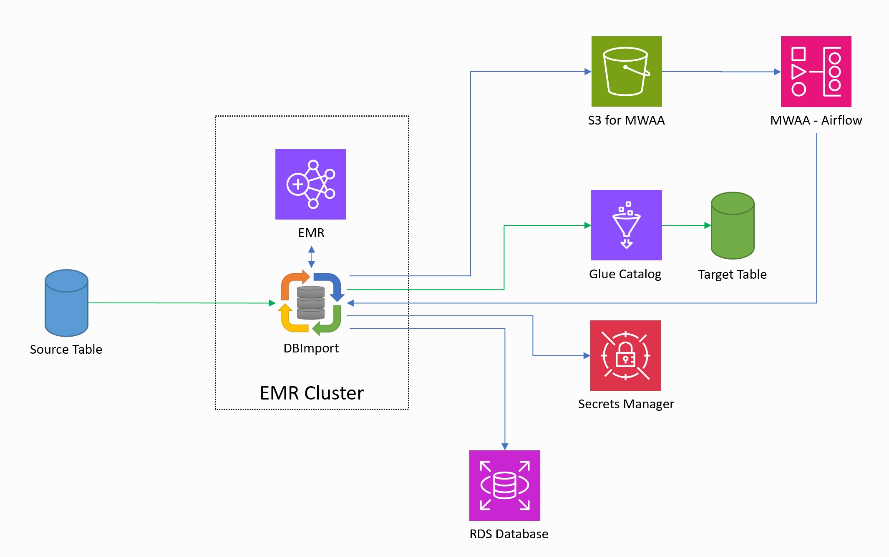

Concept
=======

General description
-------------------

DBImport is at the most basic level a ELT tool that automatically loads data from JDBC sources through SQL and store the data in a data lakehouse, like Cloudera Data Platform, AWS Lake Formation among others. The loads are done through micro-batches where each table is a separate micro-batch. Scheduling, dependencies and such are handled with Airflow and DBImport have an integration with Airflow allowing it to auto-generate all the required DAGs in order to start the micro-batches.

The general flow of an import is the following
  1. Connect to the source system to get the schema for the table. Column name, type, descriptions, indexes, primary keys and foreign keys are fetched. 
  2. Load the data from the source system and store it in the *Import table*
  3. Validate the data to make sure that we loaded the same amount of data that exists in the source system
  4. If validation passes, the data is loaded into the *Target table*. This is the table that end-users should access.
  5. We do another validation to make sure the *Target table* is loaded correctly
  6. If a *History table* should be created, this is loaded based of the changed rows in the *Target table*

Import methods
--------------

There are three  different ways to import tables with DBImport. Full import, incremental import and Change Data Tracking. Full import does exactly what is says. It imports an entire table from the source system to Hive. The second options is to use an Incremental Import. This will only read changed rows from the source system and adds them to the *Target Table*. This is great for tables that only get new data and never removes anything, as deletes are not catched by the incremental import. The last option is using Change Data Tracking (CDT). Compared to CDC, CDT read the data over SQL instead of accessing the transaction logs on the source system. Only changed data will be transferred. For more information on all these different methods, please check the :doc:`import_method` page.

Export methods
--------------

DBImport can also export the data from the data lakehouse to a SQL database. There are two different ways to do this and that’s Full export and Incremental export. Please check the :doc:`export_method` page.

History Audit Table
-------------------

This is basically a log of the changes that have happened in the table between the two last imports. If it is an incremental load, we already know that the rows have been changed and it's a simple insert into the *History Audit table*. But sometimes you need to log the changes but there is no column that allows you to identify if the row was updated or not. The *Full History Audit* import is the solution for that. What it does is that it reads the entire table from the source system and then compare based on the Primary Key (or a combination of columns that generate unique values) if any of the columns for that row was changed. If it was, it updates the row with new data but also log the changes in the History Audit Table. This way, you can use the History Audit Table as an audit function to see what have been changed from one day to another in each table that uses this import function.

Table Changes
-------------

The tables in the source systems changes, and usually without telling the data lakehouse environment about it. DBImport handles this automatically for you. Each time an import is running, DBImport connects to the source system and reads the table schema and saves it in it's configuration database. Based on this data, the column in the *Target table* is changed so it contains the same rows with the same column type and comment as the source system. So if the source system adds a column, DBImport adds it as well. If the column type changes or a column comment changes, DBImport will do the same. And this is for both the Import, Target and History table.

Different Table types
---------------------

DBImport uses different tables depending on the operation it's performing. 

- | *Import table*
  | These are the first tables data gets loaded to. The format of the files is a bit different depending on how the import is configured. Is you are using Hive as the ETL Engine, then it's Parquet when using Sqoop and ORC when using Spark. But if you are using Spark as the ETL Engine, then the format is Iceberg.
- | *Target table*
  | The real table that you want the data to end up in. If you are using Hive as the ETL Engine, then it's ORC and for Spark, it's Iceberg
- | *History Audit table*
  | History information based on the changes in the *Target table*. Table format follows the same rule as for the *Target table*
- | *Delete table*
  | To handle deletes and log them into the *History table*, we need to save the rows that are being deleted into a separate table. This table only contains the columns that is part of the Primary Key. This table exists in the same database as the *Import table* and is usually not accessable for the end users. Table format follows the same rule as for the *Target table*
- | *Temporary Export table*
  | Sqoop export is very limited compared to the imports. To overcome some of these limitation, it's sometimes required to create a staging table that we load from the real Hive table and then the sqoop export will export the data from the *Temporary Export table* instead. This is also the way incremental exports are handled. We load the *Temporary Export table* with the changed rows and then make a full export from there to the *Target table*. In certain cases, this might also be needed for Spark. 

Import Validation
-----------------

During import, there will be three validations for each imported table. Validation in this context is either a rowcount and comparing the number of rows between the two tables or a custom SQL query executed on both source and target table. Depending on what method for validation is used, the process is a bit different.

Row count valdation 

  1. The first validation happens in the *import stage* and is done after sqoop/spark is executed. It compares the number of rows in the source system against the number of rows that sqoop or spark reported that it read. If this is an incremental import, then only the incremental values are compared. This means that the select statement against the source system includes the min and max values in a where statement
  2. Second validation is done after the import table is created. This validates the number of rows in the Parquet or Orc files against the source system. If it is an incremental import, then only the imported rows are validates. Same way as the first validation.
  3. The last validation occurs after the target table is loaded. This might be a full or incremental validation based on the configuration for that specific table. Incremental validation works the same way as the other two validations and the Full validation is comparing the total amount of rows between source and target table regardless of how many rows was imported.

Custom SQL validation

  1. Validation of sqoop or spark imported data is not possible with custom SQL validation. So this will be skipped here
  2. Validation of *Import table* is done by running the custom SQL on the source system and another custom SQL on the *Import table*. The result is saved in a json and these two json documents are compared to each other.
  3. The last validation is of the *Target table*. The custom SQL will be executed aginst *Target table* and the same query that was executed in step 2 against the source table will be used. The result is saved in a json and the two json documents are compared to each other.

Export Validation
-----------------

For exports, there will be only one validation and that is at the end of the export. There is also two different validation methods available for exports, same as for imports. It's a row count or executing a custom SQL on both tables and compare the result. 

Sqoop and Spark
-----------------

DBImport support both sqoop and spark. This is selectable on table level and you can run with different tools on different import/exports on the same installation. 

If you are running Hive 3.x, all tables in Hive are transactional tables. Sqoop cant export tables that are transactional tables. So if you are running Hive 3.x, you are forced to use spark for the export tool.

ETL Engine
----------

After Import is completed there will be an ETL step. This is where data is being loaded from the initial save on hdfs/s3 and gets loaded into the target table. This is also where History tables are created. Default ETL Engine is Hive. This means that after Spark or Sqoop have loaded the data, a session to Hive is established and the load from the data saved on HDFS too Hive will start.

From version 0.8, there is now also support to use Spark as the ETL engine. The benefit for this is that it will already have most of the data loaded in memory and by that, reduce the amount of I/O required. It also removes the need to start a Hive session and running the queries through that. Running with Spark as the ETL engine will also force the usage of Iceberg as the table format. At the release date of DBImport V0.8, CDP Private Cloud v7.1.8 does not support Iceberg out of the box. So additional steps needs to be taken in order to get Iceberg support in the current version of CDP. For more information on how to do this, please read under Installation.

AWS
---

DBImport have full support of running on an AWS environment. The low-level design for the DBImport on AWS is the following.

- | DBImport is using an EMR cluster to execute the imports and running the Spark query. 
- | AWS Glue Catalog is used as the catalog for databases and tables
- | Spark is the only supported ETL engine. THis means that Iceberg will be the fileformat used for all tables
- | AWS RDS MariaDB or MySQL is supported as the configuration database for DBImport
- | AWS Secrets Manager can be used for username and password for both the configuration database and the jdbc connection credentials
- | Managed Airflow service, AWS MWAA, can be used for scheduling the imports. This means that the manage command writes the Airflow DAG directly to the S3 bucket for Airflow DAGs. The DAGs created bu DBImport is using SSM send-command to start the tasks on the primary node on the EMR cluster. 

