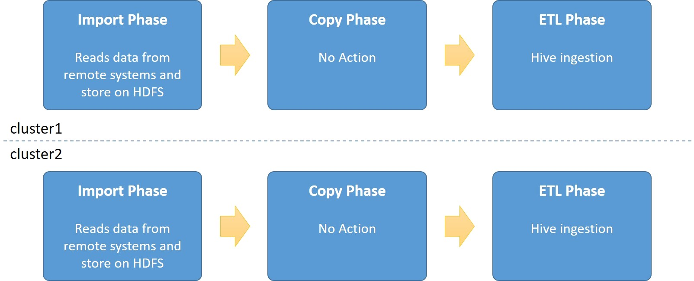
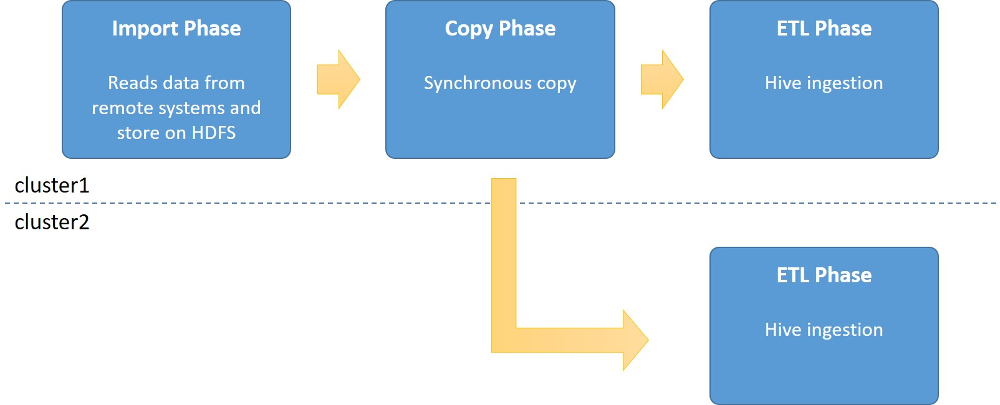
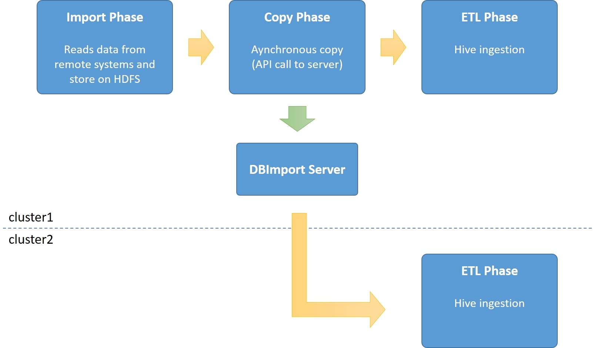

Multi Cluster Imports
=====================

Many companies today have more than one Hadoop environment. One of the challenges with those environments it to make sure that data is available and updated on all environments at the same time. The first and simple way to do this is to make sure both clusters import the same data from the same remote system. But that will double the load on the remote systems as there is now more than one system reading the data. And for many installations, this is a big No-No. 

DBImport multi-cluster Imports will help you with this specific problem. The core of the multi-cluster Imports is to make sure that data is available at more than one Hadoop cluster at the same time but only read the data from the remote system ones. 

**Import without Multi-Cluster Imports**

As a reference, this is what happens if an import is executed on two cluster at the same time but without multi-cluster imports enabled. Both clusters will import the data from the remote SQL database at the same time and will create double the impact on the remote SQL database.

**Import with Synchronous copy**

Synchronous copy means that it’s the actual Import command that will be running the *distcp* copy after the spark/sqoop command have been executed and before the Hive ingestions starts. This means that the total import time on cluster1 in the picture will be a bit longer as the time for the *distcp* command will be included.

**Import with Asynchronous copy**

Running with asynchronous copy is the default method for importing large datasets to multiple clusters. The Import command will not run the actual *distcp* command, but instead signal DBImport Server to start the copy. Once the signal is sent, the Import will continue to the ETL phase and run the Hive ingestion. 

The DBImport server will make sure that the copy to the other cluster will succeed. So if there is an error in the copy, it will retry until the copy is completed. So if for example cluster2 in the picture is unavailable for some reason, the copy will happen once the cluster is up again.

One thing to take into consideration with asynchronous copy is the incremental imports. If an incremental import is running and signals to the DBImport server that it should copy the data to a remote cluster, but that cluster is unavailable, the next import can’t continue. Reason for this is that if you start the next day’s copy before the previous is completed, the incremental data from the previous day haven’t been processed on the remote cluster. And that would mean data loss on the remote system. So incremental imports will fail if the previous remote copy can’t be completed.

