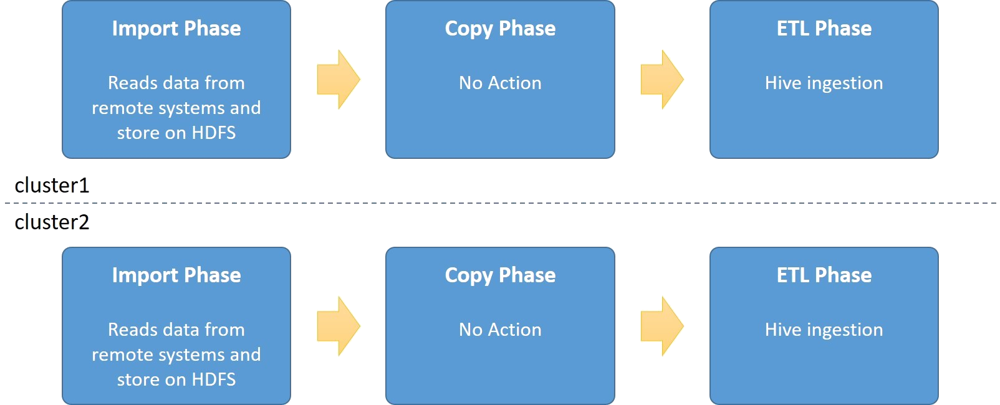
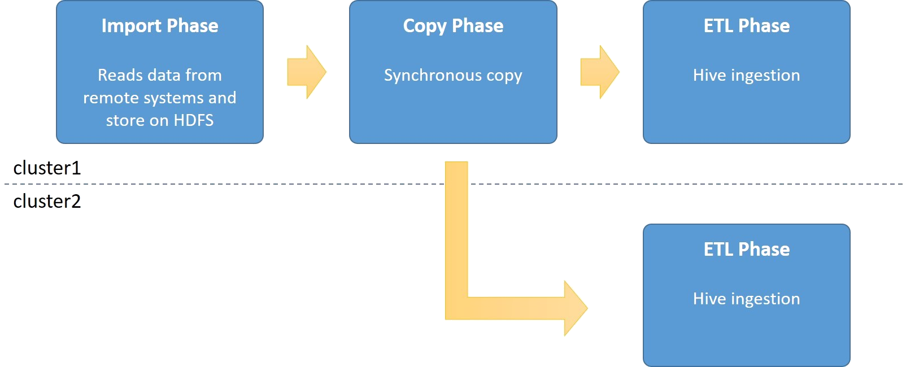
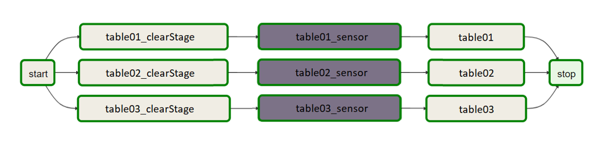

Multi Cluster Imports
=====================

Many companies today have more than one Hadoop environment. One of the challenges with those environments it to make sure that data is available and updated on all environments at the same time. The first and simple way to do this is to make sure both clusters import the same data from the same remote system. But that will double the load on the remote systems as there is now more than one system reading the data. And for many installations, this is a big No-No. 

DBImport multi-cluster Imports will help you with this specific problem. The core of the multi-cluster Imports is to make sure that data is available at more than one Hadoop cluster at the same time but only read the data from the remote system ones. 

**Import without Multi-Cluster Imports**

As a reference, this is what happens if an import is executed on two cluster at the same time but without multi-cluster imports enabled. Both clusters will import the data from the remote SQL database at the same time and will create double the impact on the remote SQL database.

**Import with Synchronous copy**

Synchronous copy means that it’s the actual Import command that will be running the *distcp* copy after the spark/sqoop command have been executed and before the Hive ingestions starts. This means that the total import time on cluster1 in the picture will be a bit longer as the time for the *distcp* command will be included.

**Import with Asynchronous copy**

Running with asynchronous copy is the default method for importing large datasets to multiple clusters. The Import command will not run the actual *distcp* command, but instead signal DBImport Server to start the copy. Once the signal is sent, the Import will continue to the ETL phase and run the Hive ingestion. 

The DBImport server will make sure that the copy to the other cluster will succeed. So if there is an error in the copy, it will retry until the copy is completed. So if for example cluster2 in the picture is unavailable for some reason, the copy will happen once the cluster is up again.

.. image:: img/multi-cluster_async.png

One thing to take into consideration with asynchronous copy is the incremental imports. If an incremental import is running and signals to the DBImport server that it should copy the data to a remote cluster, but that cluster is unavailable, the next import can’t continue. Reason for this is that if you start the next day’s copy before the previous is completed, the incremental data from the previous day haven’t been processed on the remote cluster. And that would mean data loss on the remote system. So incremental imports will fail if the previous remote copy can’t be completed.

Configuration
-------------

The first thing to configure is the connection to the remote DBImport instance. This is done in the *dbimport_instances* table. The following information must be entered

================= ================================================================================
name              Name of the connection. Usually the remote system cluster name defined in HDFS
db_hostname       Host where the MySQL database is running
db_port           Port where the MySQL database is running
db_database       Name of the DBImport database in MySQL
db_credentials    Leave empty right now. Will use the *manage* command to encrypt the data
hdfs_address      HDFS address to the remote cluster. Like *hdfs://<CLUSTER>:8020*
hdfs_basedir      HDFS directory structure on where to copy the data
================= ================================================================================

Once all that is in the table, you can use the *manage* command with the –encryptInstance option to encrypt the username and password for a user with select/insert/update/delete permissions in MySQL::

      ./manage –encryptInstance

You now have a working connection to the remote DBImport instance. Next step is to define what table should be copied to what remote DBImport instance. This is done in the *copy_tables* table.  Enter the following information in that table

================= ================================================================================
hive_filter       <HIVE DB>.<HIVE TABLE>. Supports wildcard, so ‘testdb.*’ is a valid entry
destination       Select the remote DBImport instance configured earlier
data_transfer     Asynchronous or Synchronous transfer
================= ================================================================================

Running multi-cluster import
----------------------------

On the cluster where you configured the remote connection, you can now start the normal import command. No additional parameters or options is needed. The Import command will identify that it needs to copy the data to the remote cluster. Depending on data_transfer method, the command will copy the data itself or send a call to the DBImport server with information on what to copy. The copy itself will also copy the information in *jdbc_connections*, *import_tables* and *import_columns* to the remote DBImport instance. 

The main difference in the remote DBImport instance will be a setting in the column *copy_slave* in the *import_tables*. If this is set to 1, the Import command on the remote system will  not execute a Sqoop or Spark import, but instead assume that the data on HDFS is fresh and loaded and will start the ETL phase directly.

**How do I know that the data is fresh on HDFS?**

As soon as the data is copied to the remote DBImport instance, the value in the *copy_finished* column in *import_tables* are updated. So if you need to know if the data is fresh and updated, look at the values in there. This is also the column that the Airflow integration is using on the Sensors in order to start the import as soon as new data is available. See the Airflow integration for multi-cluster ingestion for more information on this.

        

